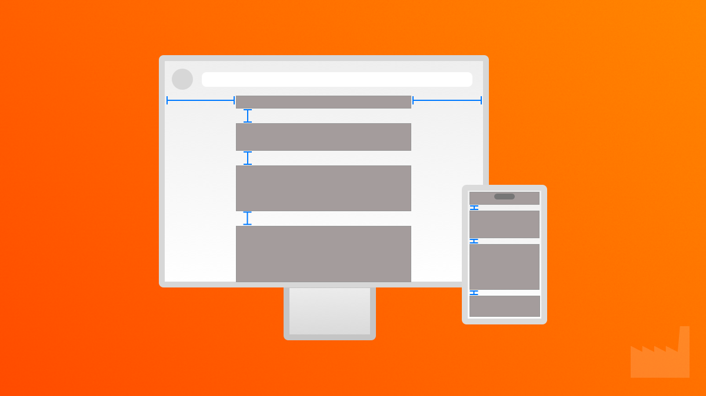

# Flutter Platform Aware Padding Demo

[](https://github.com/dartfoundry/flutter_platform_padding)

This Flutter demo showcases how to use responsive, platform-aware padding to make your UI feel less boxy and more natural across devices. It’s a simple, focused example designed to help developers enhance layout polish with minimal effort.

## Features

- `platformAwarePadding()` utility function that adjusts padding based on platform type and screen size.
- Visually adaptive layout for mobile, tablet, and desktop.
- Unit test included to verify padding logic.
- Minimal, single-file architecture for quick learning and reuse.

## Getting Started

1. Clone or unzip the repo
2. Run `flutter pub get`
3. Launch on different devices or emulators to observe the effect of platformAwarePadding() in action.

## Testing

Run the test suite using:

```sh
flutter test
```

## Article

Want the full breakdown? Read the accompanying guide:

[Responsive Padding: How to Make Your Flutter UI Feel Less Boxy)](https://medium.com/dartfoundry/806e488789ae)

## Copyright

Copyright © 2025 Dom Jocubeit

## License

MIT
